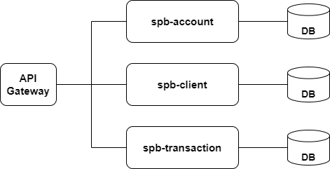

# Smart Banking Portal
"Smart Banking Portal" is an intuitive application that enables users to manage their bank accounts, track detailed transactions, and securely handle personal information. With a focus on convenience and security, the application provides easy access to financial information, offers full control over accounts, and allows for quick transactions.

# For Development
## Prerequisites
- [Java 21+](https://adoptium.net/temurin/releases/)

Initial microservices structure



Running the microservices:
```
// sbp-transaction
./gradlew :sbp-transaction:bootRun

// sbp-client
./gradlew :sbp-client:bootRun

// sbp-account
./gradlew :sbp-account:bootRun
```

Runnig the set of tests
```
./gradlew clean test
```